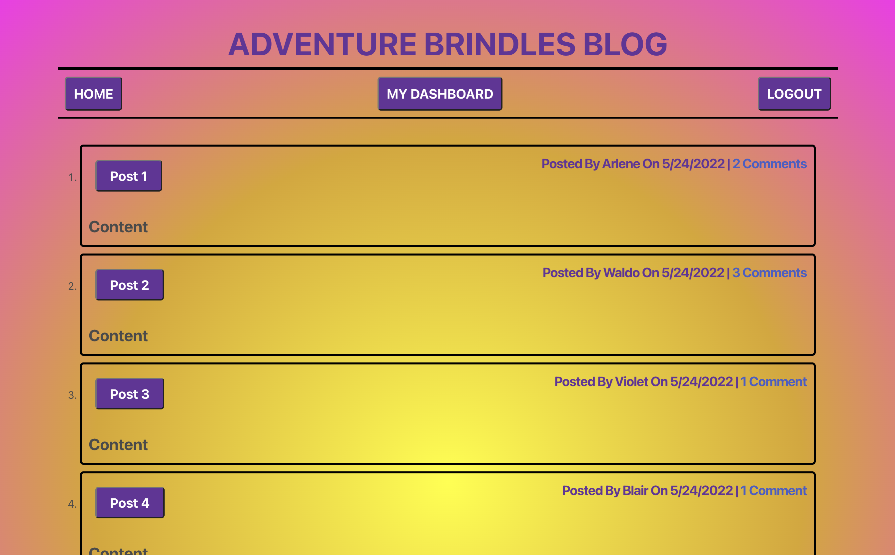

# Adventure Brindles Blog

  ## Deployed Link on Heroku:
 https://adventure-brindles-blog.herokuapp.com/

  ## Description
  The purpose of this blog application is to inform and entertain. There will be posts about fun places that my dogs like to play and go hiking. Users from anywhere in the world are able to make profiles and once logged in, can make their own posts and comment reviews on existing posts. This allows for a global connection of dog owners to write about places that they have found to be especially fun for their dogs. Users will be able to learn about parks, hiking trails, places to swim, dog friendly restaurants and more. I'd like to add the ability for users to upload photos of their dogs to ilustrate the places being written about. Also, as the app grows, I'd like to make the option to seach for posts by category or location available.
  
  ## Table of Contents
  * [Usage](#usage)
  * [Contributing](#contributing)
  * [Screenshots](#screenshots)

 
  ## Usage
Visit the website at the link below, sign up for an account, and begin posting and viewing blogs.
  
  ## Contributing
  My name is Blair Seivers and I can be reached for any questions on this project by email at
  blair.seivers@gmail.com  
  You can view my other projects on GitHub here: https://github.com/dogmom3
  
  ## Screenshots
  
  
  

 